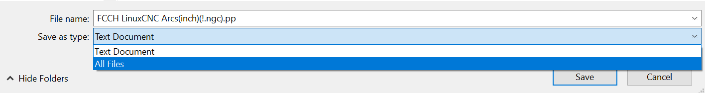
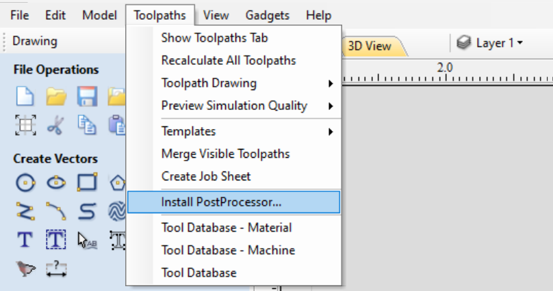
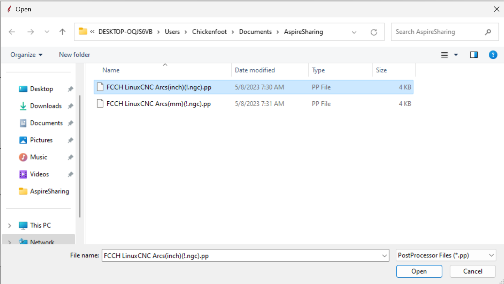
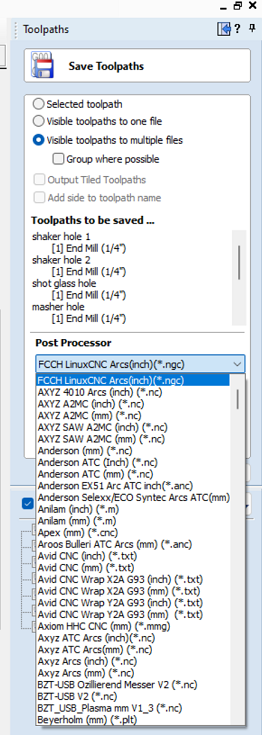

# Vectric Post-processor Installation and Usage

Below outlines steps for installing the FCCH post-processor configurations for both VCarve Pro and Aspire.

## Download Files

Choose one of the below links (or both) to retrieve the raw configuration:

- [FCCH LinuxCNC post-processor inches](https://raw.githubusercontent.com/fortcollinscreatorhub/cnc/master/wood-48x48/software/vcarve-post-processors/FCCH%20LinuxCNC%20Arcs(inch)(!.ngc).pp)
- [FCCH LinuxCNC post-processor mm](https://raw.githubusercontent.com/fortcollinscreatorhub/cnc/master/wood-48x48/software/vcarve-post-processors/FCCH%20LinuxCNC%20Arcs(mm)(!.ngc).pp)

Then, `right click -> Save as...` and instead of saving it as a `Text Document`, save it as type `All Files`:

## VCarve Pro

## Version 11.5

As of v11.5 (at least in the Makerspace edition), you can no longer create or
edit custom post-processors. Vectric support needs to import any
customizations for you, then you can download them by updating the post-
processor database. Use the following pre-configured post-processors:

* LinuxCNC Archs(inch)(*.ngc)
* MS \- FCCH LinuxCNC Arcs(mm)

### Tell Vectric you want to create some custom post-processors
 
* Open a project.
* Choose `Machine Menu -> Post-Processor Management`.
* For each LinuxCNC pre-processor, click the edit button on the right, select customize.
* This will save original files into the following dir for editing:
  `C:\ProgramData\Vectric\VCarve Pro - Makerspace Edition\V11.0\My_PostP`

### Install FCCH's custom post-processors

* Rename the files in `My_PostP` to match the naming in the files archived in git; add prefix "FCCH " to the filename.
* Copy the git versions over the renamed files.
* Restart Vectric.

### Create a machine definition for the FCCH machine

* Choose `Machine Menu -> Machine Configuration`.
* Click `Create new machine`.
* _Name_: FCCH 48x48.
* _Manufacturer_: Custom.
* _Model_: FCCH 48x48.
* _Controller_: G-Code.
* _Width_: 48.
* _Height_: 48.
* _Unit_: Inches.
* _Associated Post-Processor_: Remove any defaults, add the 2 FCCH post-processors.
* Double-click the FCCH inches post-processor to set it as default

## Aspire

On the top set of tabs, choose `Toolpaths -> Install PostProcessor...`:

Navigate to where you saved your `.pp` files, and select the one you want to install:

You will be asked if you want to make this the default post-processor. Choose yes if you don't want to hunt it down in the rather
long list of provided post-processors later.

Finally, when you go to save your toolpath, select the FCCH post-processor from the list before exporting:

